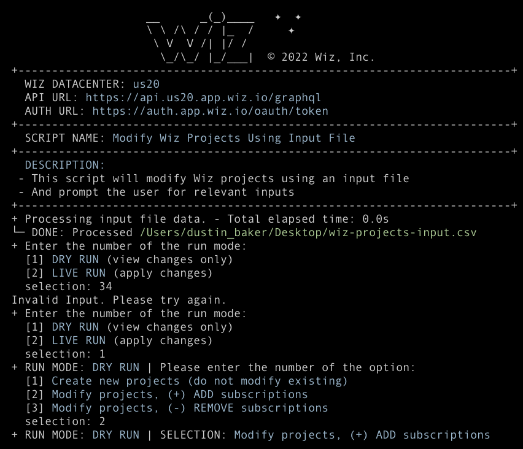

 © 2022 Wiz, Inc.
 By using this software and associated documentation files (the “Software”) you hereby agree and understand that:
 1. The use of the Software is free of charge and may only be used by Wiz customers for its internal purposes.
 2. The Software should not be distributed to third parties.
 3. The Software is not part of Wiz’s Services and is not subject to your company’s services agreement with Wiz.
 4. THE SOFTWARE IS PROVIDED “AS IS”, WITHOUT WARRANTY OF ANY KIND, EXPRESS OR IMPLIED,
 INCLUDING BUT NOT LIMITED TO WARRANTIES OF MERCHANTABILITY, FITNESS FOR A PARTICULAR PURPOSE AND NONINFRINGEMENT.
 IN NO EVENT SHALL WIZ BE LIABLE FOR ANY CLAIM, DAMAGES OR OTHER LIABILITY,
 WHETHER IN AN ACTION OF CONTRACT, TORT OR OTHERWISE, ARISING FROM, OUT OF OR IN CONNECTION WITH THE USE OF THIS SOFTWARE
 OR THE USE OR OTHER DEALINGS IN THE SOFTWARE.

## Please configure your `wiz_config.json` and update the script at line `35` with the path to the file.

An example of the file can be found 

## Please reference the `input_file_example.csv` as a reference for the input format
- Note the list of `cloudAccounts` is wrapped in `" "` double quotes, this is REQUIRED!

```
VALID:
wiz_project_name,cloudAccounts
"example_aws_proj","111111111111,222222222222,333333333333"
"example_azure_proj","azure_sub1,azure_sub2"
"example_gcp_proj","gcp_proj1,gcp_proj2"
"example_mixed_cloud", "444444444444,azure_sub3,gcp_proj3"
```

## This script currently supports the following options for `cloudAccounts` ONLY
```
RUN_MODE_OPTIONS = {
    "1": "DRY RUN",
    "2": "LIVE RUN",
}
PROJECT_MODIFY_OPTIONS = {
    "1": "Create new projects (do not modify existing)",
    "2": "Modify projects, (+) ADD subscriptions",
    "3": "Modify projects, (-) REMOVE subscriptions",
}
```

## Output example

